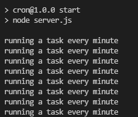

# node-cron

### node-cron이란?

> crontab기반의 node.js용 작업 스케줄러이다

### node-cron 설정

스케줄 시간 설정 문법

```
second(초), minute(분), hour(시), day-of-month(날짜), month(월), day-of-week(요일)
 # ┌────────────── second (optional)
 # │ ┌──────────── minute
 # │ │ ┌────────── hour
 # │ │ │ ┌──────── day of month
 # │ │ │ │ ┌────── month
 # │ │ │ │ │ ┌──── day of week
 # │ │ │ │ │ │
 # │ │ │ │ │ │
 # * * * * * *
```

사용 방법

```js
const cron = require("node-cron");

cron.schedule(
  "0 1 * * *",
  () => {
    console.log("Running a job at 01:00 at America/Sao_Paulo timezone");
  },
  {
    scheduled: true,
    timezone: "America/Sao_Paulo",
  }
);
```

### 에러 해결

에러 문구

```js
Error: Cannot find module 'uuid';
code: 'MODULE_NOT_FOUND',
requireStack: [
  '{url}\\cron\\node_modules\\node-cron\\src\\scheduled-task.js',
  '{url}\\cron\\node_modules\\node-cron\\src\\node-cron.js',
  '{url}\\cron\\server.js'
]
```

해결 방법

```js
npm i uuid
```

### 공식 문서

> [https://www.npmjs.com/package/node-cron](https://www.npmjs.com/package/node-cron)

### 실행 이미지
