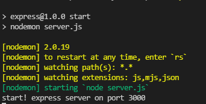

# express

### express 설명

> express는 node 프레임워크로 서버를 쉽게 생성할 수 있습니다

### express 설치

```js
npm init
npm i express
```

### express 셋팅

> 3000번 port로 서버를 열어주는 코드입니다

```js
const express = require("express");
const app = express();
app.listen(3000, function () {
  console.log("start! express server on port 3000");
});
```

### 미들웨어
> express는 next로 다음 미들웨어로 넘기는데, next의 인자의 갯수로 결정한다 예를 들어 다음의 코드에
인자가 4개 이기 때문에 "B"미들웨어를 탄다
<br/>
> return을 만나기 전에 미들웨어는 종료가 안되기 때문에 ```req.user = {...}```해당 형식으로 다음 미들웨어에 값을 넘길 수 있다
```js
app.get('/',(req,res,next)=>{
  req.user = {
    ...user,
    des : "user info"
  }
  next(user);
});

### A 미들웨어
app.use((req,res,next)=>{
  ...내용
});

### B 미들웨어
app.use((result,req,res,next)=>{
  console.log(`req.user === ${result}`);
  ...내용
});
```

### 공식 문서

> [https://www.npmjs.com/package/express](https://www.npmjs.com/package/express)

### 샘플 이미지
