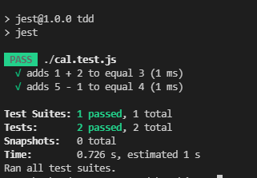

# jwt

### jwt 설명

> jwt(json web token)이란 JSON 웹 토큰은 두 당사자 간에 안전하게 클레임을 나타내기 위한 개방형 산업 표준 RFC 7519 방법

### 공식 문서

> [https://jwt.io/](https://jwt.io/)

> [https://www.npmjs.com/package/jsonwebtoken](https://www.npmjs.com/package/jsonwebtoken)

### 샘플 이미지
